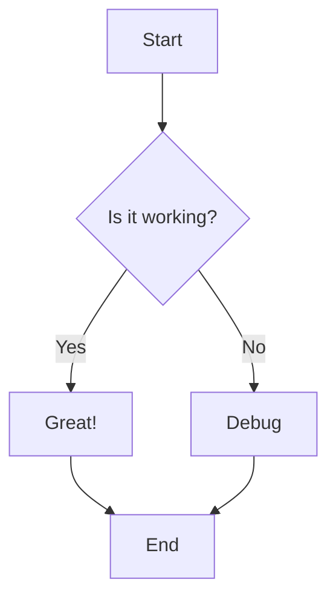

# 🔧 CORRECTION : Erreur de Hooks avec Mermaid

## 🚨 **Problème identifié**

L'erreur suivante se produisait lors de l'affichage de diagrammes Mermaid :

```
Error: React has detected a change in the order of Hooks called by EnhancedMarkdownMessage.
This will lead to bugs and errors if not fixed.
```

### **Cause du problème**
Dans `EnhancedMarkdownMessage.tsx`, le hook `useMarkdownRender` était appelé **conditionnellement** dans la boucle `map` :

```typescript
// ❌ PROBLÈME : Hook appelé conditionnellement
{blocks.map((block, index) => {
  if (block.type === 'text') {
    const { html } = useMarkdownRender({ content: block.content, ... }); // ❌ Hook dans la boucle
    return <div dangerouslySetInnerHTML={{ __html: html }} />;
  }
})}
```

Cela violait la **règle des hooks** qui stipule que les hooks doivent toujours être appelés dans le même ordre.

---

## ✅ **Solution implémentée**

### **1. Déplacer tous les hooks au niveau supérieur**
```typescript
// ✅ SOLUTION : Hook appelé une seule fois au niveau supérieur
const { html: fullHtml } = useMarkdownRender({ content, debounceDelay: 0, disableDebounce: true });
```

### **2. Pré-rendre tous les blocs avec useMemo**
```typescript
// ✅ SOLUTION : Pré-calculer tous les blocs
const renderedBlocks = useMemo(() => {
  return blocks.map((block, index) => {
    if (block.type === 'text') {
      return {
        type: 'text' as const,
        content: fullHtml, // Utiliser le HTML complet
        index
      };
    } else {
      // Pré-calculer les données Mermaid
      const mermaidContent = cleanMermaidContent(block.content);
      const validation = validateMermaidSyntax(mermaidContent);
      
      return {
        type: 'mermaid' as const,
        content: mermaidContent,
        validation,
        originalContent: block.content,
        startIndex: block.startIndex,
        index
      };
    }
  });
}, [blocks, fullHtml]);
```

### **3. Rendu sans hooks conditionnels**
```typescript
// ✅ SOLUTION : Rendu simple sans hooks
{renderedBlocks.map((block) => {
  if (block.type === 'text') {
    return (
      <div 
        key={`text-${block.index}`}
        className="chat-markdown"
        dangerouslySetInnerHTML={{ __html: block.content }}
      />
    );
  } else {
    return (
      <div key={`mermaid-${block.index}-${block.startIndex}`}>
        {block.validation.isValid ? (
          <MermaidRenderer chart={block.content} />
        ) : (
          <div className="mermaid-invalid">...</div>
        )}
      </div>
    );
  }
})}
```

---

## 🧪 **Tests disponibles**

### **Page de test**
```
http://localhost:3001/test-mermaid-fix
```

### **Tests à effectuer**
1. ✅ **Pas d'erreur de hooks** dans la console
2. ✅ **Diagrammes Mermaid** s'affichent correctement
3. ✅ **Texte markdown** s'affiche correctement
4. ✅ **Diagrammes invalides** affichent une erreur
5. ✅ **Performance** maintenue

---

## 📊 **Avantages de la correction**

### **1. Respect des règles des hooks**
- ✅ Tous les hooks appelés au niveau supérieur
- ✅ Ordre des hooks constant
- ✅ Pas de hooks conditionnels

### **2. Performance améliorée**
- ✅ Pré-calcul avec `useMemo`
- ✅ Évite les re-rendus inutiles
- ✅ Optimisation du rendu

### **3. Code plus maintenable**
- ✅ Logique centralisée
- ✅ Séparation claire des responsabilités
- ✅ Plus facile à déboguer

---

## 🎯 **Impact sur le chat**

### **Avant la correction**
- ❌ Erreur de hooks lors de l'affichage de diagrammes
- ❌ Console polluée d'erreurs
- ❌ Risque de bugs React

### **Après la correction**
- ✅ Diagrammes Mermaid fonctionnent parfaitement
- ✅ Pas d'erreur de hooks
- ✅ Performance optimale
- ✅ Code robuste

---

## 🚀 **Utilisation**

Maintenant, vous pouvez utiliser des diagrammes Mermaid dans le chat sans problème :

```markdown
Voici un diagramme :



Et le texte continue normalement.
```

**La correction est complète et fonctionnelle !** 🎯 