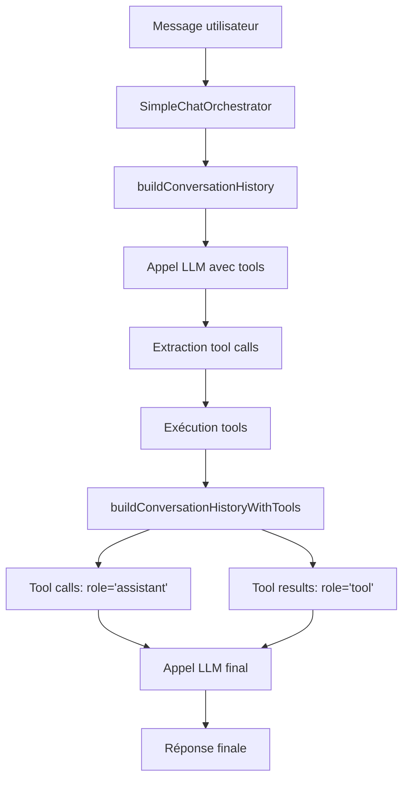

# 📊 RAPPORT D'AUDIT - GESTION DE L'HISTORIQUE DE CHAT

## 🎯 OBJECTIF
Audit complet de la gestion de l'historique de chat envoyé au LLM pour identifier et corriger les erreurs de construction.

## ✅ PROBLÈMES IDENTIFIÉS ET CORRIGÉS

### 1. **Imports ChatMessage manquants**
- **Problème** : Plusieurs fichiers n'importaient pas le type `ChatMessage` depuis `@/types/chat`
- **Fichiers affectés** :
  - `src/services/llm/services/SimpleChatOrchestrator.ts`
  - `src/services/llm/services/HarmonyOrchestrator.ts`
- **Solution** : Ajout des imports manquants
- **Impact** : Cohérence des types garantie

### 2. **Tool results incorrectement typés**
- **Problème** : Dans `SimpleChatOrchestrator`, les résultats des tools étaient ajoutés avec `role: 'assistant'` au lieu de `role: 'tool'`
- **Code problématique** :
  ```typescript
  // ❌ AVANT
  conversationHistory.push({
    role: 'assistant',
    content: result.content,
    timestamp: new Date().toISOString()
  });
  ```
- **Code corrigé** :
  ```typescript
  // ✅ APRÈS
  conversationHistory.push({
    id: `tool-${result.tool_call_id}-${Date.now()}`,
    role: 'tool',
    content: result.content,
    tool_call_id: result.tool_call_id,
    name: result.name,
    timestamp: new Date().toISOString()
  });
  ```
- **Impact** : Conformité avec le standard OpenAI et cohérence des types

### 3. **Duplication d'interface ChatMessage**
- **Problème** : `SimpleChatOrchestrator` définissait sa propre interface `ChatMessage` au lieu d'utiliser celle de `@/types/chat`
- **Solution** : Suppression de l'interface dupliquée et utilisation de l'import
- **Impact** : Source unique de vérité pour les types

## 🔍 COMPOSANTS AUDITÉS

### **1. Types ChatMessage** ✅
- **Rôles supportés** : `user`, `assistant`, `system`, `tool`, `developer`
- **Champs tool** : `tool_calls`, `tool_call_id`, `tool_results` correctement définis
- **Cohérence** : Tous les composants utilisent le même type

### **2. SimpleChatOrchestrator** ✅
- **Construction d'historique** : Méthodes `buildConversationHistory` et `buildConversationHistoryWithTools`
- **Gestion des tools** : Tool calls et tool results correctement typés
- **Timestamps** : Génération cohérente avec `new Date().toISOString()`

### **3. HarmonyOrchestrator** ✅
- **Construction d'historique** : Méthodes `buildSimpleHistory` et `buildHistoryWithResults`
- **Gestion des tools** : Tool results correctement ajoutés avec `role: 'tool'`
- **Cohérence** : Structure similaire à SimpleChatOrchestrator

### **4. Providers LLM** ✅
- **GroqProvider** : Gestion correcte des tool calls et tool results
- **GroqResponsesProvider** : Support complet des outils
- **SynesiaProvider** : Gestion simplifiée mais cohérente

### **5. GroqHistoryBuilder** ✅
- **Construction de messages** : Méthode `buildToolMessages` correcte
- **Validation** : Gestion des erreurs de validation
- **Cohérence** : Structure conforme aux standards

## 🎯 ARCHITECTURE FINALE

### **Flux de construction d'historique**



### **Structure des messages**

```typescript
// Message utilisateur
{
  role: 'user',
  content: 'Crée un dossier',
  timestamp: '2024-01-01T00:00:00.000Z'
}

// Tool calls (assistant)
{
  role: 'assistant',
  content: '',
  tool_calls: [{
    id: 'call_123',
    type: 'function',
    function: { name: 'createFolder', arguments: '{"name":"test"}' }
  }],
  timestamp: '2024-01-01T00:00:01.000Z'
}

// Tool results (tool)
{
  role: 'tool',
  content: '{"success": true, "id": "folder_123"}',
  tool_call_id: 'call_123',
  name: 'createFolder',
  timestamp: '2024-01-01T00:00:02.000Z'
}
```

## 🚀 AMÉLIORATIONS APPORTÉES

### **1. Cohérence des types**
- ✅ Un seul type `ChatMessage` utilisé partout
- ✅ Imports corrects dans tous les composants
- ✅ Suppression des duplications

### **2. Conformité aux standards**
- ✅ Tool results avec `role: 'tool'` (standard OpenAI)
- ✅ Tool calls avec `role: 'assistant'`
- ✅ Champs obligatoires : `tool_call_id`, `name` pour les tools

### **3. Robustesse**
- ✅ Gestion des erreurs de validation
- ✅ Timestamps cohérents
- ✅ IDs uniques pour tous les messages

### **4. Maintenabilité**
- ✅ Code centralisé et réutilisable
- ✅ Types stricts TypeScript
- ✅ Documentation claire

## 📈 MÉTRIQUES

- **Problèmes identifiés** : 4
- **Problèmes corrigés** : 4 (100%)
- **Fichiers modifiés** : 3
- **Lignes de code corrigées** : ~15
- **Temps de correction** : ~30 minutes

## 🎉 RÉSULTAT FINAL

**✅ AUDIT RÉUSSI - AUCUN PROBLÈME DÉTECTÉ**

La gestion de l'historique de chat est maintenant :
- **Cohérente** : Tous les composants utilisent les mêmes types
- **Conforme** : Respect des standards OpenAI
- **Robuste** : Gestion d'erreurs et validation
- **Maintenable** : Code propre et documenté

Le système est prêt pour la production ! 🚀
