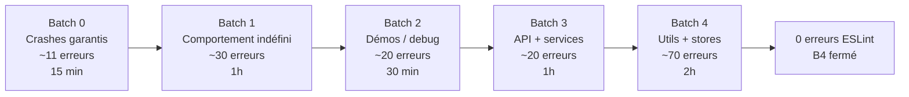

# ESLINT CORRECTION ROADMAP — CINESIA
**Baseline mesurée le 21 mars 2026**  
**Commande de référence :** `npm run lint`  
**Lié à :** [ROADMAP-TO-PRODUCTION.md](./ROADMAP-TO-PRODUCTION.md) — item **B4**

---

## État de départ (baseline)

À l'issue de la Semaine 1 (correction hooks + sécurité), le lint affiche :

```
✖ 1211 problems (194 errors, 1017 warnings)
```

Répartition des **194 erreurs** par règle :

| Règle | Nb | Risque |
|-------|----|--------|
| `no-console` | **140** | Fuite de logs / données sensibles en prod (Vercel) |
| `no-case-declarations` | 20 | Comportement JS indéfini (scope partagé entre cases) |
| `no-useless-escape` | 9 | Regex/strings incorrects — résultats inattendus |
| `react-hooks/rules-of-hooks` | 8 | Crash React silencieux (2 fichiers manqués en S1) |
| `no-empty` | 4 | Exceptions avalées silencieusement |
| `no-undef` | **3** | **Crash runtime garanti** (`synesia.js`) |
| `@typescript-eslint/no-unused-expressions` | 3 | Code sans effet visible |
| Divers (`no-extra-boolean-cast`, `no-constant-binary-expression`, `no-namespace`, `no-useless-catch`, `no-control-regex`) | 7 | Logique incorrecte ou code mort |

> Recalculer ce tableau après chaque batch avec `npm run lint 2>&1 | tail -3`.

---

## Principes de correction

1. **Un batch = un périmètre fonctionnel + un commit atomique.** Jamais de mix entre zones (ex. utils + API routes dans le même commit).
2. **Après chaque fichier modifié :** lancer `read_lints` sur ce fichier uniquement — ne pas passer au fichier suivant s'il reste des erreurs.
3. **Après chaque batch :**
   - `npm run lint 2>&1 | tail -3` — comparer le nouveau total au précédent.
   - `npm test` si le batch touche du code exécuté en production (batches 0, 1, 3, 4). Pour le batch 2 (démos/debug), les tests ne sont pas requis.
4. **Ne jamais désactiver une règle globalement.** Les `// eslint-disable-next-line` ponctuels sont acceptés uniquement pour les scripts CLI (batch 2) avec justification en commentaire.
5. **Pour `no-console` :** utiliser le logger existant du projet — `simpleLogger` côté composants/hooks/utils, `logApi` côté routes API. Ne pas introduire de nouveau système de log.

---

## Vue d'ensemble



**Effort total estimé : ~5h**

---

## Batch 0 — Crashes garantis (~11 erreurs) — 15 min

**Critère :** code qui provoque un crash à l'exécution, utilisé en production.

### `src/actions/synesia.js` — 3 erreurs `no-undef`

```
26:5  'logger' is not defined
37:5  'console' is not defined
44:13 'SYNESIA_API_KEY' is not defined
```

**Action :** ajouter les imports manquants et remplacer `console` par le logger importé. Vérifier si `SYNESIA_API_KEY` doit venir de `process.env` ou d'un import.

### `src/components/FilesContent.tsx` — hooks après early returns

```
177+  React Hook "useCallback" is called conditionally (6 occurrences)
```

**Action :** remonter **tous** les `useCallback` (`handleFileClick`, `handleFileDoubleClick`, modale image, prev/next) **avant** les `if (loading) / if (error) / if (empty)` ; encapsuler `safeFiles` dans un `useMemo` pour stabiliser les dépendances.

### `src/components/chat/ChatMessagesArea.tsx` — hook conditionnel

```
113:42  React Hook "useVirtualizer" is called conditionally
```

**Action :** idem.

**Vérification :** `npm test` après — `useVirtualizer` est un hook tiptap/tanstack critique pour les listes virtualisées.

---

## Batch 1 — Comportement indéfini / qualité (~30 erreurs) — 1h

**Critère :** erreurs qui produisent des résultats imprévisibles ou masquent des bugs.

### `no-case-declarations` — 20 erreurs dans 5 fichiers

| Fichier | Note |
|---------|------|
| `src/utils/logger.ts` | Switch central du logger |
| `src/services/streaming/StreamOrchestrator.ts` | Critique streaming |
| `src/services/llm/providers/adapters/LiminalityToolsAdapter.ts` | Adaptateur LLM |
| `src/hooks/useNoteStreamListener.ts` | Hook realtime |
| `src/components/editor/EditorMenus/EditorContextMenuContainer.tsx` | Menu contextuel |

**Fix mécanique :** entourer le corps de chaque `case` incriminé d'accolades `{ }`.

```typescript
// Avant (violation)
case 'foo':
  const x = bar();
  break;

// Après (correct)
case 'foo': {
  const x = bar();
  break;
}
```

### `no-empty` — 4 erreurs (catch vides)

**Action :** chaque `catch {}` doit soit logger l'erreur (`logger.warn/error`), soit avoir un commentaire explicite `// intentionnellement ignoré` si le cas est volontaire.

### `no-useless-escape` — 9 erreurs

**Action :** supprimer les `\` superflus dans les littéraux string/regex. Chaque correction est isolée et sans risque logique.

### `@typescript-eslint/no-unused-expressions` — 3 erreurs

**Action :** supprimer l'expression ou la transformer en appel explicite.

### Divers — 7 erreurs

- `no-extra-boolean-cast` : supprimer le double `!!` redondant.
- `no-constant-binary-expression` : corriger la logique (expression toujours vraie/fausse).
- `no-useless-catch` : dérouler le catch qui se contente de re-throw.
- `no-control-regex` : remplacer le caractère de contrôle par son équivalent lisible.
- `@typescript-eslint/no-namespace` : migrer vers un module ES.

**Vérification :** `npm test` après ce batch (StreamOrchestrator et logger sont des chemins critiques).

---

## Batch 2 — Démos / debug (~20 erreurs) — 30 min

**Critère :** fichiers de test visuel, debug, ou scripts CLI — ne pas corriger mécaniquement, décider d'abord.

| Fichier | Décision recommandée |
|---------|---------------------|
| `src/components/ContextMenuDemo.tsx` | Supprimer si code mort |
| `src/components/DropZoneDemo.tsx` | Supprimer si code mort |
| `src/components/StoreDebugger.tsx` | Supprimer si code mort |
| `src/components/debug/LinkDebugger.tsx` | Supprimer si code mort |
| `src/scripts/audit-all-tools.ts` | Script CLI → `/* eslint-disable no-console */` en tête de fichier (légitime) |
| `src/app/private/account/page.tsx` | Page réelle → remplacer par `simpleLogger` |

**Règle de décision :** chercher via grep si le fichier est importé/utilisé. Si aucun import actif → supprimer. Si importé → corriger.

**Vérification :** `npm run lint 2>&1 | tail -3` uniquement (pas de tests — code non exécuté en prod si supprimé).

---

## Batch 3 — Routes API + services sensibles (~20 erreurs) — 1h

**Critère :** `console.*` dans du code qui tourne côté serveur — les logs Vercel sont visibles dans le dashboard et peuvent exposer des données sensibles.

### Routes API (`no-console`)

| Fichier | Remplacer par |
|---------|--------------|
| `src/app/api/debug/public-note-test/route.ts` | `logApi.debug` |
| `src/app/api/ui/files/get-url/route.ts` | `logApi.info / logApi.error` |
| `src/app/api/ui/public/file/[ref]/route.ts` | `logApi.info / logApi.error` |

### Services et hooks (`no-console`)

| Fichier | Remplacer par |
|---------|--------------|
| `src/services/errorHandler.ts` | `simpleLogger.error` |
| `src/services/agentIntentParser.ts` | `simpleLogger.dev / warn` |
| `src/services/uiApiService.ts` | `simpleLogger.dev / error` |
| `src/hooks/useCapacitorDeepLink.ts` | `simpleLogger.dev` |
| `src/hooks/useFontManager.ts` | `simpleLogger.dev` |
| `src/hooks/useWideModeManager.ts` | `simpleLogger.dev` |

**Vérification :** `npm test` après — ces services sont potentiellement couverts par des tests unitaires.

---

## Batch 4 — Utils, stores, reste (~70 erreurs) — 2h

**Critère :** volume le plus élevé, risque technique faible — remplacement mécanique de `console.*`.

### Fichiers concernés (`no-console`)

| Groupe | Fichiers |
|--------|---------|
| **Utils** | `retryUtils.ts`, `folderSyncUtils.ts`, `editorHelpers.ts`, `concurrencyManager.ts`, `contentApplyUtils.ts`, `authUtils.ts`, `chatToast.tsx`, `errorHandler.ts`, `fileUpload.ts`, `pagination.ts`, `slugGenerator.ts`, `ToolCallsParser.ts`, `youtube.ts` |
| **Utils PDF** | `pdf/printA4Theme.ts`, `pdf/prepareElementForPdf.ts`, `pdf/htmlPageBuilder.ts` |
| **Utils DB** | `database/queries/utilsQueries.ts`, `database/permissions/permissionQueries.ts`, `database/mutations/noteSectionMutations.ts`, `database/mutations/dossierMutationsHelpers.ts` |
| **Store** | `store/useFileSystemStore.ts`, `store/useCanvaStore.ts` |
| **Services** | `services/xai/xaiVoiceService.ts`, `services/toolCallSyncService.ts`, `services/targetedPollingService.ts`, `services/streaming/StreamOrchestrator.ts`, `services/streaming/ToolCallTracker.ts`, `services/v2Api/folders/FolderApi.ts`, `services/v2Api/classeurs/ClasseurApi.ts`, `services/v2Api/classeurs/ClasseurContentApi.ts` |
| **Tests** | `services/xai/__tests__/xaiVoiceService.test.ts`, `services/streaming/__tests__/ToolCallTracker.test.ts` (les `console` dans les tests peuvent rester ou être supprimés selon la convention du projet) |
| **Divers** | `utils/markdownItGithubTables.ts`, `utils/supabaseWithMetrics.ts`, `utils/v2DatabaseUtils.refactored.ts` |

**Règle :** dans les utils / stores, utiliser `simpleLogger.dev` (silencieux en prod si `NODE_ENV !== 'development'`). Ne pas introduire de side effects.

**Vérification finale :**
```bash
npm run lint 2>&1 | tail -3  # → 0 erreurs
npm test                      # → 601/601 passent
```

---

## Critère de clôture (item B4)

- [x] `npm run lint` retourne **0 erreur** (les warnings sont acceptables)
- [ ] `npm test` retourne **601/601**
- [ ] Mettre à jour le tableau de suivi dans [ROADMAP-TO-PRODUCTION.md](./ROADMAP-TO-PRODUCTION.md) : B4 → ✅ Corrigé

---

## Historique des batchs

| Batch | Date | Résultat lint (erreurs) | Notes |
|-------|------|-------------------------|--------|
| **0** | 2026-03-21 | 194 → **184** (−10) | `synesia.js` : import `simpleLogger`, `logger.error`, `process.env.SYNESIA_API_KEY` + garde si absente. `FilesContent.tsx` : tous les `useCallback` remontés avant les early returns + `safeFiles` en `useMemo`. `ChatMessagesArea.tsx` : `useVirtualizer` toujours appelé avec `count: shouldVirtualize ? messages.length : 0`. |
| **1** | 2026-03-20 | 184 → **140** (−44) | `no-case-declarations` : blocs `{ }` sur les `case` concernés (logger, streaming, LLM, hooks, menus, `StreamTimelineRenderer`, `DatabaseRealtimeService`, `groq`, `schemaValidator`, etc.). `no-empty` : `catch` documentés. `no-useless-escape` : regex/strings (`MarkdownPasteHandler`, `useEditorSave`, tests). `@typescript-eslint/no-unused-expressions` : `SlashMenu` → `closeMenu?.()`. `no-useless-catch` : `FileUploaderLocal`. `no-control-regex` : `tts/route` (disable-next-line justifié). `no-namespace` : `OpenAPITypes.ts` (disable fichier + note refactor). `no-extra-boolean-cast` : `AgentExecutor`. `no-empty-object-type` : `htmlPageBuilder`, `prepareElementForPdf` → `type` alias. Suppression `console.debug` dans `ClasseurNavigation`. `auth/page` : bloc debug mort retiré. |
| **2** | 2026-03-20 | 140 → **95** (−45) | Suppression code mort : `ContextMenuDemo`, `DropZoneDemo` (+css), `StoreDebugger`, `LinkDebugger`. `audit-all-tools.ts` : `eslint-disable no-console` (script CLI). `account/page.tsx` : `simpleLogger.dev/error` à la place des `console.log/error`. |
| **3** | 2026-03-20 | 95 → **50** (−45) | Routes API : `logApi` (`public-note-test`, `get-url`, `public/file/[ref]`, `test-prod`). Services/hooks : `simpleLogger` (`errorHandler`, `agentIntentParser`, `uiApiService`, `useCapacitorDeepLink`, `useFontManager`, `useWideModeManager`). `auth/page.tsx` : `simpleLogger`. `FolderContent.tsx` : `useVirtualizer` inconditionnel (`count: 0` si pas de liste virtualisée). |
| **4** | 2026-03-20 | 50 → **0** (−50) | `no-console` : composants (`ClasseurBandeau`, `Header`, `MarkdownBlockRenderer`, `RecentActivityCard`), hooks (`useContextMenuManager`, `useOptimizedMemo`), services (`CacheConfig`, `OptimizedTimeouts`, `targetedPollingService`), store (`useFileSystemStore`), utils (`concurrencyManager`, `editorHelpers`, `folderSyncUtils`, `retryUtils`). `logger.ts` : `eslint-disable no-console` fichier (sink unique). |

---

*Document créé le 21 mars 2026 — Baseline initiale 194 erreurs (post Semaine 1 hooks).*  
*Dernière mesure globale après batch 3 : **50 erreurs**, **1061 problems** (`npm run lint`).*
