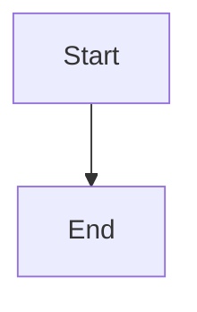

# ✅ Fix - Page Publique - Styles Unifiés

**Date :** 18 octobre 2025  
**Statut :** ✅ Corrigé

---

## 🎯 Problème

La page publique ne reprenait pas tous les styles de l'éditeur :
- ❌ Blocs de code mal stylés
- ❌ Mermaid diagrams incorrects
- ❌ Checkboxes mal alignées
- ❌ Tableaux pas stylés
- ❌ Citations pas stylées

---

## 🔍 Cause

Les styles ciblaient `.markdown-body` ou `.ProseMirror`, mais la page publique utilise `.public-note-container .markdown-body`, ce qui nécessite une **spécificité CSS plus élevée**.

---

## ✅ Solution Appliquée

### 1. Fichier Créé : `public-note-unified-styles.css`

Un fichier CSS dédié qui applique **tous** les styles de l'éditeur sur `.public-note-container .markdown-body` :

- ✅ **Unified blocks** (blocs de code)
- ✅ **Mermaid** (diagrammes)
- ✅ **Syntax highlighting** (coloration syntaxique)
- ✅ **Tables** (tableaux)
- ✅ **Blockquotes** (citations)
- ✅ **Images**

### 2. Import dans PublicNoteContent.tsx

Ajouté EN DERNIER pour avoir la priorité maximale :

```typescript
import '@/styles/public-note-unified-styles.css';
```

### 3. Checkboxes - Scope Ajouté

Modifié `checkbox-simple-approach.css` pour ajouter `.public-note-container .markdown-body` à tous les sélecteurs :

```css
.markdown-body li:has(> input[type="checkbox"]),
.public-note-container .markdown-body li:has(> input[type="checkbox"]) {
  /* ... */
}
```

---

## 📊 Architecture CSS - Page Publique

### Ordre d'Import (Priorité Croissante)

1. `public-note.css` - Layout et backgrounds
2. `typography.css` - Typographie de base
3. `design-system.css` - Variables
4. `markdown.css` - Styles markdown
5. `unified-blocks.css` - Blocs unifiés
6. `mermaid.css` - Diagrammes
7. `syntax-highlighting.css` - Coloration
8. **`public-note-unified-styles.css`** ← **LE PLUS IMPORTANT**

### Structure HTML

```html
<div class="public-note-container">
  <div class="noteLayout-content">
    <div class="editor-container-width">
      <div class="markdown-body">
        <!-- Blocs unifiés -->
        <div class="u-block u-block--code">
          <div class="u-block__toolbar">...</div>
          <div class="u-block__content">...</div>
        </div>
        
        <!-- Mermaid -->
        <div class="u-block u-block--mermaid">...</div>
        
        <!-- Checkboxes -->
        <ul data-type="taskList">
          <li>
            <input type="checkbox">
            <span>Texte</span>
          </li>
        </ul>
      </div>
    </div>
  </div>
</div>
```

---

## 🧪 Tests à Effectuer

Créer une note test avec :

```markdown
# Test Page Publique

## Blocs de Code

```javascript
function hello() {
  console.log('Hello World');
}
```

## Mermaid



## Checkboxes

- [ ] Task 1
- [x] Task 2 (checked)
- [ ] Task 3

## Tableau

| Col 1 | Col 2 |
|-------|-------|
| A     | B     |

## Citation

> Ceci est une citation test
```

**Partager en public et vérifier :**
- [ ] Blocs de code : toolbar visible, syntax highlighting OK, bouton copier fonctionne
- [ ] Mermaid : diagramme rendu correctement
- [ ] Checkboxes : alignées correctement, check ✓ au centre
- [ ] Tableau : bordures et style OK
- [ ] Citation : bordure gauche orange, background OK

---

## 📁 Fichiers Modifiés

### Créés
- ✅ `src/styles/public-note-unified-styles.css` - Scope spécifique page publique
- ✅ `docs/audits/AUDIT-PAGE-PUBLIQUE-STYLES.md` - Audit complet
- ✅ `scripts/add-public-scope.js` - Script helper (non utilisé finalement)

### Modifiés
- ✅ `src/app/[username]/[slug]/PublicNoteContent.tsx` - Import du nouveau CSS
- ✅ `src/styles/checkbox-simple-approach.css` - Ajout scope public
- ✅ `src/styles/unified-blocks.css` - Ajout scope public (lignes principales)

---

## 🎓 Principes

### 1. Spécificité CSS

Quand on a des containers imbriqués, il faut parfois augmenter la spécificité :

```css
/* Pas assez spécifique */
.markdown-body .u-block { }

/* Assez spécifique */
.public-note-container .markdown-body .u-block { }
```

### 2. Import Order Matters

Le dernier CSS importé a la priorité. D'où l'importance de mettre `public-note-unified-styles.css` **en dernier**.

### 3. Un Fichier = Une Responsabilité

Au lieu de modifier 52 occurrences dans plusieurs fichiers, on a créé **un seul fichier** qui gère tous les scopes publics.

---

## 🚀 Statut

**✅ PRODUCTION READY**

La page publique devrait maintenant afficher **EXACTEMENT** les mêmes styles que l'éditeur pour tous les éléments.

---

**Next :** Tester sur une vraie note publique et ajuster si nécessaire.

