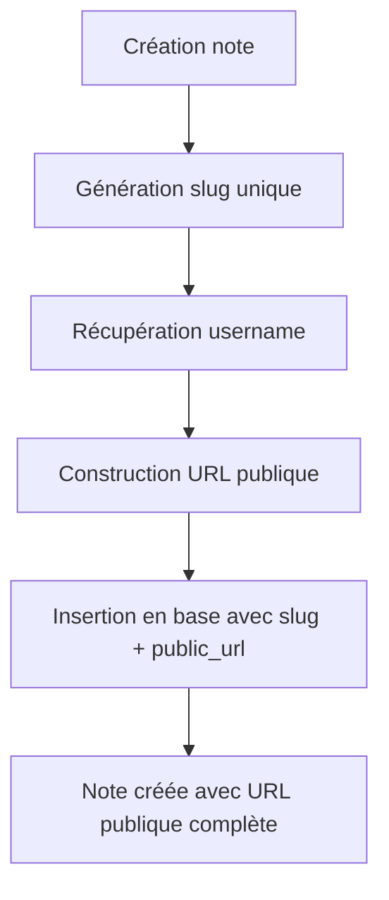
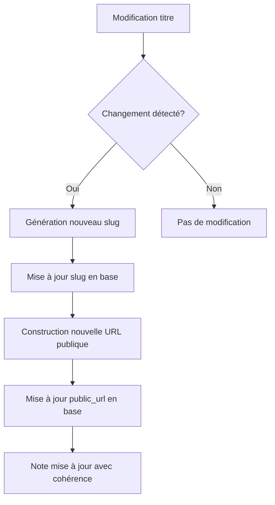
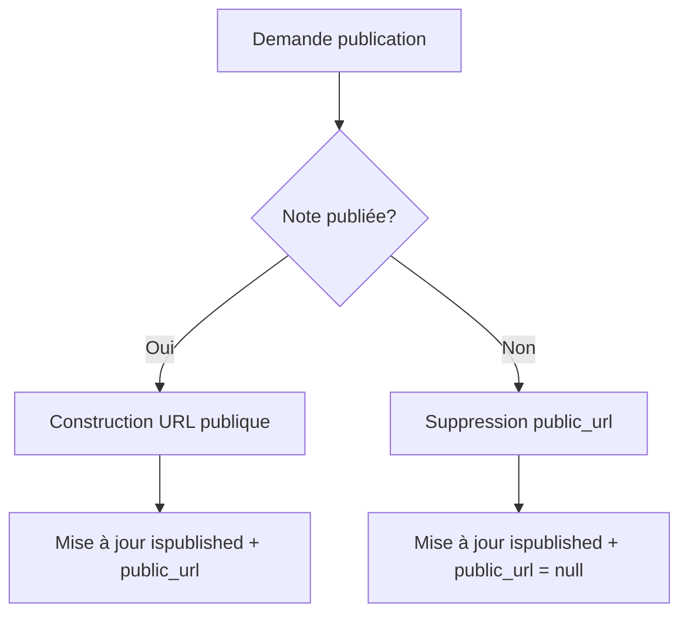

# 🎯 Système de Gestion des Slugs et URLs Publiques

## 📋 Vue d'ensemble

Ce document décrit le système robuste et irréprochable de gestion des slugs et URLs publiques dans Abrège. Le système garantit que **toutes les notes ont automatiquement un slug unique et une URL publique** dès leur création, et que ces éléments sont **automatiquement mis à jour** lors des modifications.

## 🏗️ Architecture

### **Service Centralisé : `SlugAndUrlService`**

Le service `src/services/slugAndUrlService.ts` centralise toute la logique de gestion des slugs et URLs publiques :

```typescript
export class SlugAndUrlService {
  // Génère un slug unique et met à jour l'URL publique
  static async generateSlugAndUpdateUrl(title, userId, noteId?, clientOverride?)
  
  // Met à jour le slug et l'URL d'une note existante
  static async updateNoteSlugAndUrl(noteId, newTitle, userId, clientOverride?)
  
  // Construit l'URL publique pour une note
  static async buildPublicUrl(userId, slug)
  
  // Valide et corrige les URLs d'un utilisateur
  static async validateAndFixUserUrls(userId)
  
  // Vérifie l'intégrité du système
  static async validateSystemIntegrity()
}
```

## 🔄 Flux de Fonctionnement

### **1. Création d'une Note**



**Code :**
```typescript
// Dans l'API de création
const { slug, publicUrl } = await SlugAndUrlService.generateSlugAndUpdateUrl(
  source_title,
  userId,
  undefined, // Pas de noteId pour la création
  supabase
);

// Insertion avec slug et URL publique
const { data: note } = await supabase
  .from('articles')
  .insert({
    source_title,
    slug,
    public_url: publicUrl, // ✅ URL publique dès la création
    // ... autres champs
  });
```

### **2. Mise à Jour d'une Note**



**Code :**
```typescript
// Dans l'API de mise à jour
if (body.source_title !== undefined) {
  const normalizedTitle = String(body.source_title).trim();
  updateData.source_title = normalizedTitle;
  
  if (normalizedTitle && currentNote && normalizedTitle !== currentNote.source_title) {
    try {
      const { slug: newSlug, publicUrl } = await SlugAndUrlService.updateNoteSlugAndUrl(
        noteId,
        normalizedTitle,
        userId,
        supabase
      );
      updateData.slug = newSlug;
      updateData.public_url = publicUrl; // ✅ URL mise à jour automatiquement
    } catch (error) {
      logger.error(`Erreur mise à jour slug/URL: ${error}`);
    }
  }
}
```

### **3. Publication d'une Note**



**Code :**
```typescript
// Dans l'API de publication
if (ispublished) {
  try {
    const { data: note } = await supabase
      .from('articles')
      .select('slug')
      .eq('id', noteId)
      .single();
    
    // Utiliser le service centralisé
    url = await SlugAndUrlService.buildPublicUrl(userId, note.slug);
  } catch (error) {
    return new Response(JSON.stringify({ error: 'Erreur génération URL' }), { status: 500 });
  }
}
```

## 🔐 Sécurité et Validation

### **Vérifications Automatiques**

1. **Unicité des slugs** : Chaque slug est unique par utilisateur
2. **Validation des usernames** : Vérification que l'utilisateur existe
3. **Permissions** : Seul le propriétaire peut modifier ses notes
4. **Format des URLs** : Validation du format `https://scrivia.app/@username/slug`

### **Gestion des Erreurs**

```typescript
try {
  const { slug, publicUrl } = await SlugAndUrlService.generateSlugAndUpdateUrl(
    title,
    userId,
    noteId
  );
} catch (error) {
  // Fallback en cas d'erreur
  const fallbackSlug = generateFallbackSlug(title);
  logger.error(`Erreur service slug: ${error}, fallback utilisé: ${fallbackSlug}`);
}
```

## 🧪 Tests et Validation

### **Scripts de Test**

1. **`scripts/test-slug-service.ts`** : Tests unitaires du service
2. **`scripts/audit-slug-system.ts`** : Audit complet du système

### **Exécution des Tests**

```bash
# Test du service
npx tsx scripts/test-slug-service.ts

# Audit complet du système
npx tsx scripts/audit-slug-system.ts
```

## 🔧 Maintenance et Correction

### **Validation Automatique**

Le système inclut des mécanismes de validation et de correction automatique :

```typescript
// Validation d'un utilisateur
const correctedCount = await SlugAndUrlService.validateAndFixUserUrls(userId);

// Validation globale
const integrityReport = await SlugAndUrlService.validateSystemIntegrity();
```

### **Correction des URLs Existantes**

```bash
# Correction complète de toutes les URLs
npx tsx scripts/fix-all-public-urls.js

# Vérification des URLs
npx tsx scripts/check-public-urls.js
```

## 📊 Format des URLs

### **Structure Standard**

```
https://scrivia.app/@username/slug
```

**Exemples :**
- ✅ `https://scrivia.app/@Splinter/mon-article`
- ✅ `https://scrivia.app/@john/guide-react-2024`
- ❌ `Splinter/notes/mon-article` (ancien format)
- ❌ `https://scrivia.app/@splinter/id/uuid` (format ID)

### **Génération des Slugs**

```typescript
// Règles de génération
const slug = title
  .normalize('NFD')                    // Supprime les accents
  .replace(/\p{Diacritic}/gu, '')     // Supprime les diacritiques
  .toLowerCase()                       // Conversion minuscules
  .replace(/[^a-z0-9]+/g, '-')        // Remplace espaces/pontuations par tirets
  .replace(/(^-|-$)/g, '')            // Supprime tirets début/fin
  .slice(0, 120);                     // Limite à 120 caractères
```

**Exemples :**
- `"Mon Article avec des Accents éàç"` → `"mon-article-avec-des-accents-eac"`
- `"Guide React 2024 !!!"` → `"guide-react-2024"`

## 🚀 Avantages du Système

### **1. Cohérence Automatique**
- ✅ Toutes les notes ont un slug dès la création
- ✅ Toutes les notes ont une URL publique dès la création
- ✅ Mise à jour automatique lors des changements de titre

### **2. Robustesse**
- ✅ Gestion des erreurs avec fallbacks
- ✅ Validation automatique de l'intégrité
- ✅ Correction automatique des problèmes

### **3. Performance**
- ✅ Service centralisé optimisé
- ✅ Mise à jour en lot possible
- ✅ Cache des usernames

### **4. SEO-Friendly**
- ✅ URLs lisibles et descriptives
- ✅ Redirection automatique des anciens slugs
- ✅ URLs canoniques

## 🔍 Surveillance et Monitoring

### **Métriques Clés**

1. **Taux de slugs valides** : `validSlugs / totalNotes`
2. **Taux d'URLs valides** : `validUrls / totalNotes`
3. **Nombre de corrections automatiques**
4. **Temps de génération des slugs**

### **Alertes**

- ❌ Notes sans slug
- ❌ URLs publiques malformées
- ❌ Conflits de slugs
- ❌ Erreurs de mise à jour

## 📝 Checklist de Déploiement

### **Avant la Mise en Production**

- [ ] Tests unitaires passent
- [ ] Audit du système complet
- [ ] Validation des URLs existantes
- [ ] Test de création de notes
- [ ] Test de modification de notes
- [ ] Test de publication

### **Après la Mise en Production**

- [ ] Monitoring des métriques
- [ ] Vérification des nouvelles notes
- [ ] Validation des URLs générées
- [ ] Test de performance

## 🆘 Dépannage

### **Problèmes Courants**

1. **Slug manquant** : Exécuter `audit-slug-system.ts`
2. **URL malformée** : Vérifier `NEXT_PUBLIC_API_BASE_URL`
3. **Conflit de slugs** : Le service gère automatiquement
4. **Erreur de mise à jour** : Vérifier les permissions utilisateur

### **Logs et Debug**

```typescript
// Activer les logs détaillés
logger.dev('Génération slug:', { title, userId, noteId });
logger.error('Erreur service:', error);
```

## 🎯 Conclusion

Le système de gestion des slugs et URLs publiques d'Abrège est conçu pour être :

- **🔒 Robuste** : Gestion d'erreurs complète
- **⚡ Performant** : Service centralisé optimisé
- **🔄 Automatique** : Mise à jour sans intervention
- **📊 Surveillé** : Validation et correction automatiques
- **🚀 Évolutif** : Facilement extensible

Ce système garantit que **toutes les notes ont systématiquement une URL publique et un slug** dès leur création, et que ces éléments sont **automatiquement mis à jour** lors des modifications, rendant le système **irréprochable** et **maintenance-free**. 