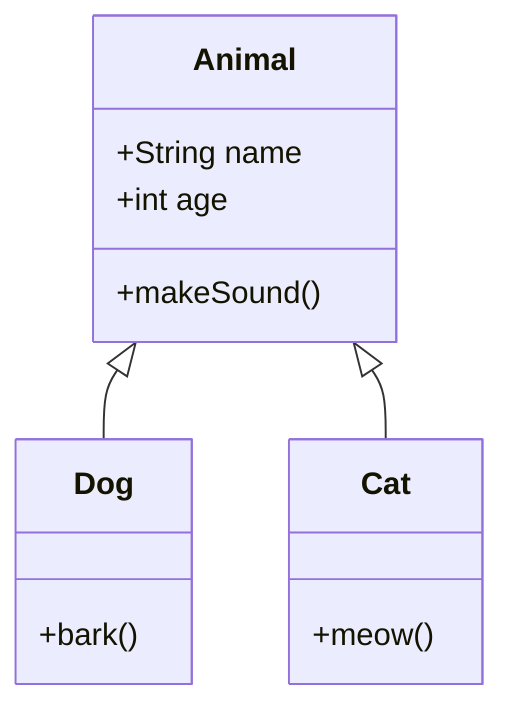

# Test Class Diagram

```mermaid
classDiagram

    class Animal {
        +String name
        +int age
        +makeSound()
    }
    class Dog {
        +bark()
    }
    class Cat {
        +meow()
    }
    Animal <|-- Dog
    Animal <|-- Cat
```

Test simple pour vérifier le rendu des class diagrams.
