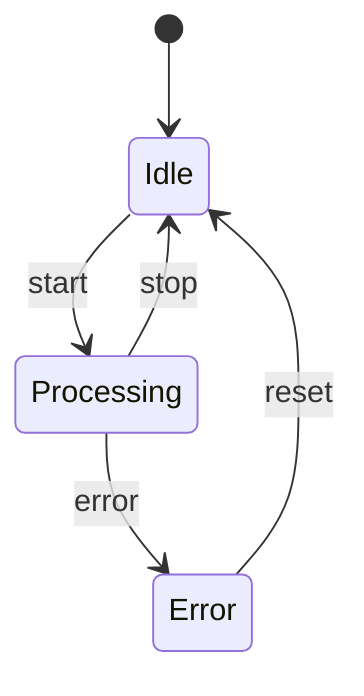

# Test State Diagram

```mermaid
stateDiagram

    [*] --> Idle
    Idle --> Processing : start
    Processing --> Idle : stop
    Processing --> Error : error
    Error --> Idle : reset
```

Test simple pour vérifier le rendu.
